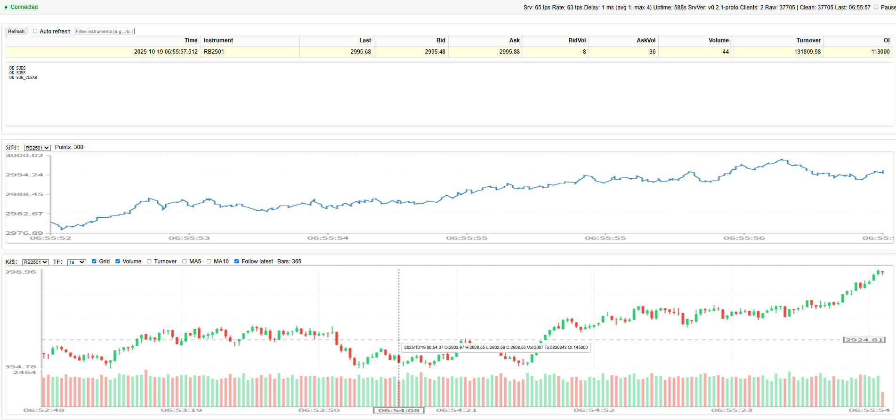
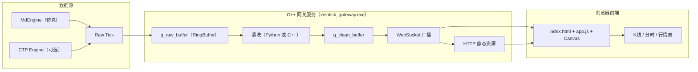

# VeloTick Gateway

**项目概览**
- 轻量级实时行情网关与浏览端展示。后端用 C++ 提供 WebSocket/HTTP，前端用原生 HTML5 Canvas 绘图。
- 默认仿真数据源（MdEngine），可选接入 CTP（桩实现预留），可嵌入 Python 做清洗/因子计算。

**效果图**

**核心功能**
- WebSocket 推送实时 Tick（Last/Bid/Ask、Volume、Turnover、OpenInterest、MA5）。
- 浏览端展示：
  - 分时图（价格随时间折线），含坐标轴与刻度、网格线。
  - K 线图（蜡烛）+ 可选 MA5/MA10、成交量、副图叠加 Turnover、网格开关、周期选择（1s~1h）。
  - 最新行情表格支持点击表头排序、筛选、暂停与自动刷新。
- HTTP 接口：`/` 静态页面；`/app.js`、`/styles.css` 前端资源；`/api/ticks/latest` 最新清洗 Tick；`/stats` 运行指标。

**项目架构**
- 后端（C++，`cpp/src`）：
  - `md_engine.cpp` 仿真行情引擎；`ctp_engine.cpp` 预留 CTP 接入（需官方库）。
  - `tick.h` Tick 结构；`tick_buffer.h` 无锁环形缓冲；`globals.cpp` 全局缓冲。
  - `tcp_server.cpp` HTTP/WS 服务（uWebSockets/uSockets + libuv + OpenSSL + zlib），静态资源从 `web/` 读取，多路径回退，禁用缓存便于前端开发。
  - `py_bridge.cpp`（可选）嵌入 Python，提供零拷贝 `velotick` 模块：`get_raw_tick()`、`put_clean_tick(...)`。
  - `main.cpp` 读取 `config/velotick.toml`，选择引擎，启动 WS/HTTP 并泵送清洗数据。
- 前端（`web/`）：`index.html` 页面与控制；`app.js` 订阅 WS、缓存/聚合、绘图；`styles.css` 样式。
- 配置（`config/`）：`velotick.toml` 控制是否启用 CTP、WS 端口、订阅合约；`instruments.txt` 示例清单。

**架构图**

**环境准备**
- Windows 10/11 x64，建议 Visual Studio 2022（v143 工具链）与 CMake ≥ 3.20。
- 编译依赖由 CMake 自动获取：pybind11（可选）、fmt、toml11、uWebSockets、libuv、OpenSSL、zlib。

**编译（MSVC 推荐）**
- 生成工程：
  - `cmake -S . -B build-msvc -G "Visual Studio 17 2022" -A x64`
- 构建 Release：
  - `cmake --build build-msvc --config Release -j`
- 可选开关（配置阶段添加）：
  - `-DVELO_NO_PYTHON=ON|OFF` 是否嵌入 Python（默认 ON 不嵌入）。
  - `-DVELO_USE_CTP=ON` 启用 CTP 接入（需准备官方库与账号）。

**编译（Ninja/另一目录）**
- `cmake -S cpp -B cpp/build -G Ninja -DCMAKE_BUILD_TYPE=Release`
- `cmake --build cpp/build -j`

**运行**
- 在项目根目录运行可执行文件（确保能读取 `web/` 静态资源）：
  - `.\build-msvc\Release\velotick_gateway.exe`
  - 或 `.\cpp\build-msvc\Release\velotick_gateway.exe`
  - 或 `.\cpp\build\velotick_gateway.exe`（如使用 Ninja 构建）
- 浏览器打开 `http://localhost:8080/` 查看实时页面。

**使用说明（前端页面）**
- 顶部状态与指标：连接状态、本地推送速率（Rate）、服务器推送速率（Srv）、服务器运行时长（Uptime）、服务器版本（SrvVer）、客户端数、缓冲大小、延迟等。
- 控制区：暂停（`Pause`）、筛选（`Filter`）、自动刷新（`Auto`）、手动刷新最新（`Refresh Latest`）。
- 分时图面板：选择合约（`Chart instrument`），显示价格随时间的折线与坐标轴刻度。
- K 线面板：选择合约与周期（`Timeframe`），可开关网格/成交量/Turnover/MA5/MA10/跟随；当成交量与 Turnover 同时开启时，副图使用双轴独立刻度（左 Volume，右 Turnover）。
- 最新表格：点击表头排序，支持筛选。

**配置**
- `config/velotick.toml` 关键项：
  - `[ctp] use_ctp=false|true` 是否使用 CTP；`front/broker/investor/password` 与 `instruments=[...]`。
  - `[ws] port=8080` WebSocket/HTTP 端口。
  - `[log] enable=false|true, path="logs/clean.csv"` 启用 CSV 日志记录清洗后 Tick（默认关闭）。
  - `[redis]` 预留，将来可用于持久化/分发。
- `config/instruments.txt` 示例合约清单；仿真与 CTP 订阅以 `toml` 中 `instruments` 为准。

**接口与数据流**
- WS 推送 Tick 字段：`ts/i/p/bp/ap/bv/av/v/to/oi/MA5/w`（`w` 为浏览时间戳）。
- HTTP：
  - `/api/ticks/latest` 返回各合约最新清洗 Tick 数组。
  - `/stats` 返回客户端数、缓冲大小、`uptimeMs`、累计广播 `ticks`、最近 1 秒 `tps`。
  - `/health` 返回 `status/version/uptimeMs/ticks/tps`，用于探活与前端展示服务器版本。
  - `/version` 返回纯文本版本号（例如 `v0.2.0-proto`）。
- 数据流：`MdEngine/CTP -> g_raw_buffer -> (Python 清洗或 C++ 直透) -> g_clean_buffer -> WS 广播 -> 前端绘图/表格`。

**Python 集成（可选）**
- 关闭 `VELO_NO_PYTHON` 后，嵌入 Python 并加载 `python/strategy_demo.py`。
- 示例 API：
  - `velotick.get_raw_tick()` 取原始 Tick（零拷贝）。
  - `velotick.put_clean_tick(ts, instrument, price, ma5)` 推送清洗结果到广播缓冲。

**CTP 接入（预留）**
- 配置并启用 `-DVELO_USE_CTP=ON`，准备官方库与账号，按 `ctp_engine.cpp` 提示实现登录、订阅与回调映射。

**开发提示**
- 静态资源响应设置了 `Cache-Control: no-store`，前端改动通常无需清缓存；如需强制刷新，可在脚本链接后加版本参数（如 `app.js?v=20251019-3`）。
- 建议从项目根运行可执行文件；已实现多路径回退，常见工作目录也能找到 `web/` 资源。

**常见问题**
- 页面无数据：确认控制台日志显示 `WebSocket server listening on port 8080`，且合约有推送（仿真/CTP）。
- 资源未更新：浏览器强刷或在 URL 追加 `?v=reloadX` 触发重新加载。
- CTP 桩模式：未链接官方库时仅打印提示，不推送真实行情。
