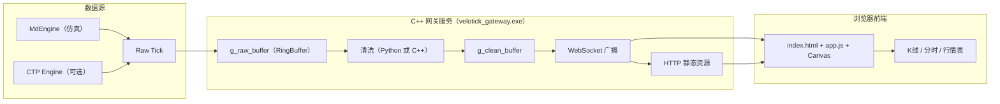

# VeloTick Gateway

**项目概览**
- 轻量级实时行情网关与浏览端展示。后端用 C++ 提供 WebSocket/HTTP，前端用原生 HTML5 Canvas 绘图。
- 默认仿真数据源（MdEngine），可选接入 CTP（桩实现预留），可嵌入 Python 做清洗/因子计算。

**效果图**


**核心功能**
- WebSocket 推送实时 Tick（Last/Bid/Ask、Volume、Turnover、OpenInterest、MA5）。
- 浏览端展示：
  - 分时图（价格随时间折线），含坐标轴与刻度、网格线。
  - K 线图（蜡烛）+ 可选 MA5/MA10、成交量、副图叠加 Turnover、网格开关、周期选择（1s~1h）。
  - 最新行情表格支持点击表头排序、筛选、暂停与自动刷新。
**HTTP 接口**：`/` 静态页面；`/app.js`、`styles.css` 前端资源；`/api/ticks/latest` 最新清洗 Tick；`/stats` 运行指标。

## 代码目录结构

```text
VeloTick/
├── cpp/
│   ├── include/            # 头文件：tcp_server.h、tick.h、candle.h、storage.h...
│   ├── src/                # 核心实现：tcp_server.cpp、md_engine.cpp、bus.cpp...
│   ├── build-msvc/         # MSVC 构建输出（Release/Debug 等）
│   └── build/              # Ninja/MinGW 等构建输出
├── config/                 # 配置：velotick.toml、instruments.txt
├── web/                    # 前端静态资源：index.html、app.js、styles.css
├── logs/                   # 运行输出：clean.csv、ohlc_1m.csv、ohlc_5s.csv 及滚动文件
├── data/                   # 示例数据导出（如 SQLite 抽取的 CSV）
├── python/                 # 清洗脚本与策略示例：clean.py、strategy_demo.py
├── ctp/                    # CTP 集成占位与说明
└── README.md               # 文档（架构、使用与故障排查）
```

## 项目架构
- 数据流：采集 → 原始缓冲 → 清洗 → 广播；聚合 5s/1m → 内存与 CSV → 可选持久化（Influx/SQLite 预留）。
- 线程模型：应用事件循环；`pump_raw_ticks` 发布原始；`pump_clean_ticks` 消费清洗；`run_aggregator_5s/1m` 并发聚合；原子指标与轻量锁保证性能与一致性。
- 日志与滚动：Tick/K 线 CSV；路径类型与可用空间校验；`maybe_rotate` 按大小重命名并重开、`prune_rotated` 保留份数并清理旧文件。
- 接口：WS 订阅/取消/心跳与 JSON 推送；HTTP 静态与 `/api/*` 查询（最新 Tick、状态、版本）。
- 主要组件：`TcpServer`、`MdEngine/CTP`、`RingBuffer`、`bus/storage`、`Candle`、`py_bridge`（可选）。

## 架构图




**环境准备**
- Windows 10/11 x64，建议 Visual Studio 2022（v143 工具链）与 CMake ≥ 3.20。
- 编译依赖由 CMake 自动获取：pybind11（可选）、fmt、toml11、uWebSockets、libuv、OpenSSL、zlib。

**编译（MSVC 推荐）**
- 生成工程：
  - `cmake -S cpp -B build-msvc -G "Visual Studio 17 2022" -A x64`
- 构建 Release：
  - `cmake --build build-msvc --config Release -j`
- 可选开关（配置阶段添加）：
  - `-DVELO_NO_PYTHON=ON|OFF` 是否嵌入 Python（默认 ON 不嵌入）。
  - `-DVELO_USE_CTP=ON` 启用 CTP 接入（需准备官方库与账号）。

**编译（Ninja）**
- `cmake -S cpp -B build -G Ninja -DCMAKE_BUILD_TYPE=Release`
- `cmake --build build -j`
- 目录约定：统一在项目根使用 `build-msvc/`（MSVC）与 `build/`（Ninja），避免同时在 `cpp/` 与根目录生成重复构建。
- 如已存在 `cpp/build/` 或 `cpp/build-msvc/`，可删除后按上述命令重新生成。

**运行**
- 在项目根目录运行可执行文件（确保能读取 `web/` 静态资源）：
  - `.\build-msvc\Release\velotick_gateway.exe`
  - 或 `.\build\velotick_gateway.exe`（Ninja 构建）
- 浏览器打开 `http://localhost:8080/` 查看实时页面。

**使用说明（前端页面）**
- 顶部状态与指标：连接状态、本地推送速率（Rate）、服务器推送速率（Srv）、服务器运行时长（Uptime）、服务器版本（SrvVer）、客户端数、缓冲大小、延迟等。
- 控制区：暂停（`Pause`）、筛选（`Filter`）、自动刷新（`Auto`）、手动刷新最新（`Refresh Latest`）。
- 分时图面板：选择合约（`Chart instrument`），显示价格随时间的折线与坐标轴刻度。
- K 线面板：选择合约与周期（`Timeframe`），可开关网格/成交量/Turnover/MA5/MA10/跟随；当成交量与 Turnover 同时开启时，副图使用双轴独立刻度（左 Volume，右 Turnover）。
- 最新表格：点击表头排序，支持筛选。

**配置**
- `config/velotick.toml` 关键项：
  - `[ctp] use_ctp=false|true` 是否使用 CTP；`front/broker/investor/password` 与 `instruments=[...]`。
  - `[ws] port=8080` WebSocket/HTTP 端口。
  - `[http] assets_dir="web"` 静态资源根目录（相对或绝对路径）；未设置时使用多路径回退查找 `web/`。
  - `[log] enable=false|true, path="logs/clean.csv"` 启用 CSV 日志记录清洗后 Tick（默认关闭）；可选 `kline_1m_path` 与 `kline_5s_path` 指定 K 线 CSV 路径（默认与 `path` 同目录，自动创建父目录）。路径支持相对或绝对；Windows 推荐使用正斜杠 `E:/data/...`，或转义反斜杠 `E:\\data\\...`。启动时会校验父目录可用空间（低于 200MB 将提示）。滚动：`rotate_mb` 设置单文件大小阈值，`rotate_keep` 保留滚动文件数；同时适用于 Tick 与 K 线 CSV。
  - `[redis]` 预留，将来可用于持久化/分发。
- `config/instruments.txt` 示例合约清单；仿真与 CTP 订阅以 `toml` 中 `instruments` 为准。

示例：
```toml
[ws]
port = 8080

[http]
assets_dir = "web"
```

English quick guide:
- `[http] assets_dir` is the static assets root (relative or absolute).
- If omitted, the server falls back to common locations under `web/`.
- Example with an absolute path:
```toml
[ws]
port = 8080

[http]
assets_dir = "E:/deploy/velotick/web"
```
Notes:
- On Windows, forward slashes are recommended in TOML strings (or escape backslashes `E:\\deploy\\velotick\\web`).
- The directory should contain `index.html`, `app.js`, and `styles.css`.

示例（日志与 K 线路径）：
```toml
[log]
enable = true
path = "logs/clean.csv"
kline_1m_path = "E:/data/velotick/ohlc_1m.csv"
kline_5s_path = "E:/data/velotick/ohlc_5s.csv"
```
说明：
- `kline_1m_path` 与 `kline_5s_path` 可选，未设置时默认在 `path` 同目录生成文件。
- 支持相对与绝对路径；父目录不存在时会自动创建。

English quick guide (K-line logging):
- `[log] kline_1m_path` and `kline_5s_path` are optional CSV outputs for OHLC bars.
- If omitted, files are created next to `path` in the same directory; parent directories are auto-created.
- Rotation uses `[log] rotate_mb` and `rotate_keep` and applies to both tick and K-line CSV files.
```toml
[log]
enable = true
path = "logs/clean.csv"
kline_1m_path = "E:/data/velotick/ohlc_1m.csv"
kline_5s_path = "E:/data/velotick/ohlc_5s.csv"
```

**静态资源与路径**
- 默认从工作目录下的 `web/` 读取静态资源，且存在多路径回退（项目根、`cpp/build-msvc/Release`、`Release` 等）。
- 可通过 `config/velotick.toml` 的 `[http].assets_dir` 显式指定资源目录，便于将资源部署到自定义位置。
- 已在 `cpp/CMakeLists.txt` 为 `velotick_gateway` 添加 `POST_BUILD` 复制步骤，构建后自动将 `web/` 与 `config/` 复制到可执行输出目录（如 `cpp/build-msvc/Release/`）。

**接口与数据流**
- WS 推送 Tick 字段：`ts/i/p/bp/ap/bv/av/v/to/oi/MA5/w`（`w` 为浏览时间戳）。
- HTTP：
  - `/api/ticks/latest` 返回各合约最新清洗 Tick 数组。
  - `/stats` 返回客户端数、缓冲大小、`uptimeMs`、累计广播 `ticks`、最近 1 秒 `tps`。
  - `/health` 返回 `status/version/uptimeMs/ticks/tps`，用于探活与前端展示服务器版本。
  - `/version` 返回纯文本版本号（例如 `v0.2.0-proto`）。
- 数据流：`MdEngine/CTP -> g_raw_buffer -> (Python 清洗或 C++ 直透) -> g_clean_buffer -> WS 广播 -> 前端绘图/表格`。

**Python 集成（可选）**
- 关闭 `VELO_NO_PYTHON` 后，嵌入 Python 并加载 `python/strategy_demo.py`。
- 示例 API：
  - `velotick.get_raw_tick()` 取原始 Tick（零拷贝）。
  - `velotick.put_clean_tick(ts, instrument, price, ma5)` 推送清洗结果到广播缓冲。

**CTP 接入（预留）**
- 配置并启用 `-DVELO_USE_CTP=ON`，准备官方库与账号，按 `ctp_engine.cpp` 提示实现登录、订阅与回调映射。

**开发提示**
- 静态资源响应设置了 `Cache-Control: no-store`，前端改动通常无需清缓存；如需强制刷新，可在脚本链接后加版本参数（如 `app.js?v=20251019-3`）。
- 建议从项目根运行可执行文件；已实现多路径回退，常见工作目录也能找到 `web/` 资源。

**常见问题**
- 页面无数据：确认控制台日志显示 `WebSocket server listening on port 8080`，且合约有推送（仿真/CTP）。也可访问 `http://localhost:8080/health` 或 `http://localhost:8080/stats` 检查服务器是否在推送；如端口被占用，请修改 `config/velotick.toml` 的 `[ws].port` 或停用占用服务。
- 资源未更新：浏览器强刷或在 URL 追加 `?v=reloadX` 触发重新加载。服务端已设置 `Cache-Control: no-store`，若仍不生效，清除浏览器缓存或检查是否存在代理层缓存。
- 静态资源路径错误：若页面 404/白屏，检查 `[http].assets_dir` 是否指向包含 `index.html/app.js/styles.css` 的目录；未设置时服务器会回退查找 `web/` 常见位置。Windows 上建议使用正斜杠路径 `E:/deploy/...` 或转义反斜杠。
- 日志/CSV 写入失败：确认 `[log].path` 以及 `kline_1m_path/kline_5s_path` 指向可写目录（存在权限）；父目录不存在会自动创建。磁盘空间不足（<200MB）或文件被占用（如 Excel 打开）会导致写入失败；关闭占用程序或调整 `rotate_mb/rotate_keep`。
- CTP 桩模式：未链接官方库时仅打印提示，不推送真实行情。
- 网络/防火墙：本机防火墙或安全软件可能拦截 WS/HTTP（默认端口 8080），请允许或更换端口。
